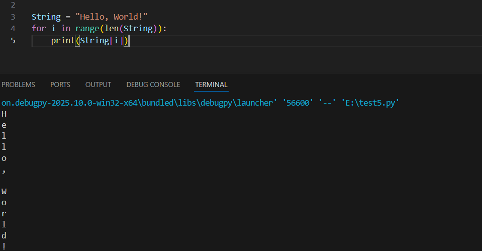
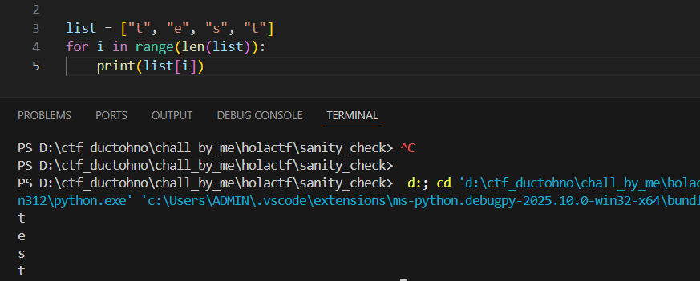
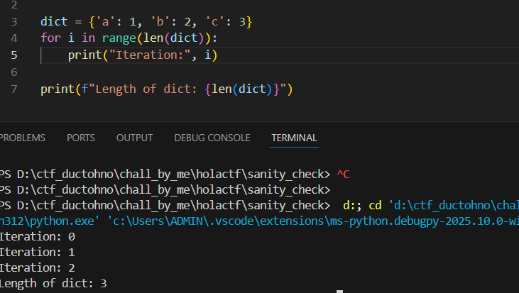

# Sanity check

## 1. Description

- Author: ductohno

Chào mừng bạn ghé thăm website “vibe coding” của mình! Thực ra mình dựng nó chỉ để test xem server cần oxi không thôi, nhưng ở đâu đó vẫn có vài lỗi nho nhỏ đang ẩn mình. Liệu bạn có tìm ra chúng không?

## 2. Phân tích

Trong đoạn code được gửi kèm chall, sau khi đọc qua thì ta có thể nhận ra đây là 1 chall về type juggeling. Tức là, ta cần bypass hàm validate và ghi được Holactf vào để ra flag

- Hàm validate:
```python
NUMBER_OF_BITS = 32*16

def is_valid_input(input):
    """Check if input is valid or not"""
    if input == '' or len(input) != NUMBER_OF_BITS:
        return False
    try:
        for char in input:
            if int(char) != 0 and int(char) != 1:
                return False
    except ValueError:
        return False
    return True

@app.route('/get_flag', methods=['GET'])
@is_User_Exist
def get_flag():
    data=read_file(get_user_filename())
    response = FLAG if "Holactf" in data else "No :v"
    return jsonify({'flag': response})
```

Hàm valide sẽ trước tiên là kiểm tra độ dài của "chuỗi" mình nhập vào, nếu khác 32*16 thì nó return False. Tiếp theo, hàm sẽ sử dụng 1 vòng for để kiểm tra từng kí tự 1 bằng cách ép kiểu của kí tự đó về int xem có bằng 0 hay 1 không. Và cuối cùng, trả về True nếu thỏa mãn tất cả phần tử trong "chuỗi" đều là 0 hoặc 1.

Nhưng có thật là thế không? Để trả lời cho câu hỏi làm sao để bypass hàm này thì chúng ta cùng nhau ôn lại về 1 trong số những kiến thức cơ bản nhất của python. Đó là cách vòng for xử lý của 1 số kiểu dữ liệu.

1. String: ừ thì nó sẽ duyệt qua từng kí tự của string đó



2. List: Duyệt từng phần tử 1 trong list



3. Dict: Cái này thì chắc nhiều người không nghĩ đến. Khi dict đi qua vòng for kia, python sẽ chỉ xét lần lượt các key của dict, chứ không hề xét đến value, ngoài ra, độ dài của dict chính là tổng số các cặp key - value trong dict



Thông qua ví dụ trên, ta dễ dàng nhận ra rằng, nếu viết `Holactf` ở value của dict, thì hàm for sẽ không thể check được. Tiếp theo, ta giải quyết vấn đề độ dài bằng việc set key dưới dạng `"0"*(số thứ tự của nó)`, vì int(00000...) thì bằng 0, nhưng về mặt key, thì 0000 lại khác 000.

Ví dụ cho payload

```
{
    "0": "Holactf",
    "00":"",
    "000":"",
    ...
}
```

## 3. Exploit

Mình để script exploit <a href="exploit.py">ở đây nha</a>

## 4. Flag
`HOLACTF{a_concident_happen_[hash]}`
